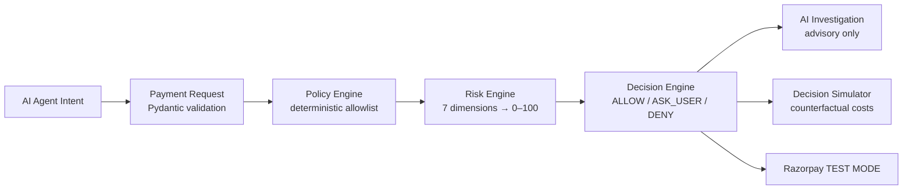

<p align="center">
  
</p>

<h1 align="center">PayTrust AI</h1>

<p align="center"><strong>Evidence-driven payment safety &amp; authorization layer for AI agents.</strong><br />
Should this AI agent be allowed to make this payment on behalf of the user?<br />
PayTrust answers with <strong>Policy → Risk → Evidence → AI Investigation → ALLOW / ASK_USER / DENY</strong>.</p>

<p align="center">
  
  
  
  
  
  
  
</p>

<p align="center"><em>Built for the Razorpay Buildathon — Track 02: AI Risk Manager.</em></p>

---

## Table of Contents

- [The Problem](#the-problem)
- [How It Works](#how-it-works)
- [Key Features](#key-features)
- [Live Evaluation Results](#live-evaluation-results)
- [Quickstart](#quickstart)
- [Deploy to Streamlit Community Cloud](#deploy-to-streamlit-community-cloud)
- [Configuration](#configuration)
- [Project Structure](#project-structure)
- [REST API](#rest-api)
- [Testing](#testing)
- [Brief → Product Mapping](#brief--product-mapping)
- [Limitations](#limitations)
- [Roadmap](#roadmap)
- [Author](#author)
- [License](#license)
- [Acknowledgments](#acknowledgments)

## The Problem

AI agents can now pick products and initiate payments on a user's behalf — but a payment system should **never blindly trust an agent with money**. A compromised, confused, or overly-eager agent can drain daily budgets, buy from blocked categories, or get socially engineered into fraudulent transfers.

PayTrust AI sits between the **agent's intent** and the **payment rail** as a deterministic safety layer. The LLM explains and investigates, but it can never approve money movement — policy and risk engines have the final word.

## How It Works



1. **Payment Request** (`models/payment_request.py`) — every intent becomes a validated object: `request_id`, `user_id`, `agent_id`, `merchant`, `amount ≥ 1`, `currency = INR`, category enum. Negatives, unknown users/agents, and bad categories are rejected here.
2. **Policy Engine** (`engines/policy_engine.py`) — deterministic authorization: daily limit ₹100,000, max transaction ₹60,000, approval above ₹30,000, allowlist `electronics / books / travel`, blocklist `gambling / financial_products`. Returns `{authorized, requires_approval, violations, reasons}`.
3. **Risk Engine** (`engines/risk_engine.py`) — seven transparent dimensions (amount, spending behavior, merchant, policy, agent auth, frequency, history) → `risk_score` 0–100 + scored factors. No black boxes.
4. **Decision Engine** (`engines/decision_engine.py`) — hard rules, no magic numbers: any violation → `DENY`; HIGH/CRITICAL risk → `DENY`; MEDIUM → `ASK_USER`; LOW + approval gate → `ASK_USER`; else `ALLOW`.
5. **AI Investigation** (`engines/ai_engine.py`) — OpenRouter → Groq → Gemini → deterministic fallback. Receives *only* structured facts, returns explanation + concerns + review questions. Advisory, never authoritative.
6. **Decision Simulator** (`engines/decision_simulator.py`) — counterfactual `ALLOW / ASK_USER / DENY` with SIMULATED fraud exposure, false-positive cost, and friction. Recommends minimum expected cost.
7. **Razorpay TEST MODE** (`services/razorpay_service.py`) — test orders, raw-body HMAC webhooks, idempotent event store. No live money, ever.

## Key Features

| Feature | What you get | Where |
|---|---|---|
| Deterministic policy gate | 10 authorization cases, LLM-proof | `engines/policy_engine.py`, `tests/test_policy_engine.py` |
| Transparent risk scoring | 7 dimensions → 0–100 with per-factor contributions | `engines/risk_engine.py` |
| Enforceable decisions | `ALLOW / ASK_USER / DENY` with stored reasons + audit trail | `engines/decision_engine.py` |
| Counterfactual simulator | "What if we allow / ask / deny?" with labeled SIMULATED costs | `engines/decision_simulator.py` |
| Fact-bound AI copilot | Strict-prompt LLM, structured facts in, JSON out, offline fallback | `engines/ai_engine.py` |
| Real-data ML signal | IEEE-CIS 590k trained model, PR-AUC evaluated, advisory only | `models/train_ieee_chunked.py` |
| Threshold tool | Pick the operating point on live precision/recall/FPR/cost curves | `models/threshold.py`, UI + `POST /v1/threshold/*` |
| REST API | `POST /v1/evaluate`, webhooks, payments, metrics, `/health`, `/ready` | `api/`, `docs/API.md` |
| Razorpay TEST MODE | HMAC-SHA256 webhooks over raw body, idempotency, DLQ accounting | `services/razorpay_service.py` |
| Observability | `request_id` tracing, redacted structured logs, metrics dashboard | `core/logger.py`, `core/metrics.py` |

## Live Evaluation Results

Trained on **IEEE-CIS Fraud Detection** (590,540 transactions, 3.5% fraud) in 50k-row chunks — never loaded whole — with a temporal 70/15/15 split. From the committed `evaluation/ieee_report.json` (LogisticRegression, held-out test `n = 3000`):

| Metric | Value |
|---|---|
| PR-AUC | **0.314** |
| ROC-AUC | **0.842** |
| Precision | 0.089 |
| Recall | **0.823** |
| F1 | 0.161 |

Low precision at the default 0.5 threshold is *expected* at 3.5% base rate — that is exactly why the product ships the **threshold tool**: merchants slide the operating point and watch precision/recall/FPR and SIMULATED cost move on real curves instead of trusting a single number. Reproduce with `python -m models.train_ieee_chunked --full` (see `docs/TESTING.md`).

## Quickstart

```powershell
python -m venv .venv; .\.venv\Scripts\Activate.ps1
pip install -r requirements.txt
copy .env.example .env  # only if you need AI/Razorpay keys (TEST MODE only)
streamlit run app.py    # → http://localhost:8501
```

Try it: **Payment Request** → `TechMart Electronics`, ₹25,000, `electronics` → `ALLOW`. Change to ₹65,000 → `DENY` (`max_transaction_exceeded`). Change category to `gambling` → `DENY` (`category_blocked`). Then open **AI Investigation** to see *why*, in plain English.

More commands:

```powershell
python -m database.inspect                  # SQLite health (WAL, tables, counts)
python -m data.synthetic --normal 500 --anomalies 50 --seed 42
python -m models.train_ieee_chunked --nrows 20000 --seed 42   # needs local IEEE CSVs
python -m api.main                          # REST API → http://localhost:8000 (/docs)
python -m pytest tests/ -q                  # 128 tests
```

## Deploy to Streamlit Community Cloud

Repo root **is** this folder, so the main file path is just `app.py`.

1. Push to GitHub (IEEE CSVs, `.env`, `*.db`, `*.pkl` are gitignored — nothing secret or oversized leaves your machine).
2. `share.streamlit.io` → **New app** → repo/branch → **Main file path:** `app.py`.
3. **Advanced settings → Python version:** `3.12` recommended (`3.14` also works).
4. **Settings → Secrets** — paste from `.streamlit/secrets.toml.example` with real values (`OPENROUTER_API_KEY` for live AI; `rzp_test_*` for TEST MODE). Save → Reboot.
5. Deploy. No `.env`, Docker, or database setup needed.

Cloud notes (by design): SQLite is ephemeral (demo data resets on reboot; committed `evaluation/ieee_report.json` + predictions still render); the 1.3 GB IEEE CSVs aren't bundled so Train/Submission disable themselves with a notice; without keys the AI uses deterministic fallback and Razorpay runs SIMULATED — nothing crashes.

## Configuration

All settings via `core/config.py` + `.env` (never committed):

| Group | Keys |
|---|---|
| App | `APP_NAME`, `ENVIRONMENT`, `SECRET_KEY` |
| Database | `DATABASE_URL` (default `sqlite:///./data/paytrust.db`) |
| Razorpay (TEST ONLY) | `RAZORPAY_KEY_ID=rzp_test_*`, `RAZORPAY_KEY_SECRET`, `RAZORPAY_WEBHOOK_SECRET` |
| LLM (priority order) | `OPENROUTER_API_KEY`, `OPENROUTER_MODEL`, `GROQ_API_KEY`, `GEMINI_API_KEY` |
| Risk | `RISK_THRESHOLD_LOW=30`, `RISK_THRESHOLD_MEDIUM=60`, `RISK_THRESHOLD_HIGH=80` |
| Cost model (SIMULATED) | `FP_*`, `FN_*` — assumptions, clearly labeled everywhere they appear |

## Project Structure

```
paytrust-ai/
├── app.py                  # Streamlit UI (10 pages)
├── api/                    # FastAPI service (evaluate, webhooks, payments, threshold)
├── core/                   # config, structured logging, security, metrics
├── database/               # SQLite WAL layer, parameterized repositories
├── engines/                # policy, risk, decision, simulator, AI
├── models/                 # payment_request, threshold, IEEE training/prediction
├── services/               # Razorpay TEST MODE
├── data/                   # synthetic generator (IEEE CSVs stay local, gitignored)
├── evaluation/             # reports + reproducible harness
├── tests/                  # 128 pytest tests
├── docs/                   # 15 technical + 4 business docs
└── requirements.txt
```

## REST API

```powershell
python -m api.main   # → http://localhost:8000, Swagger at /docs
```

- `POST /v1/evaluate` → decision + evidence + counterfactuals (`X-API-Key` auth)
- `POST /v1/webhooks/razorpay` → HMAC-verified, idempotent event intake
- `GET /v1/payments…`, `GET /v1/evaluation/metrics`, `/health`, `/ready`
- Full reference: `docs/API.md`

## Testing

```powershell
chcp 65001; $env:PYTHONUTF8="1"
python -m pytest tests/ -q
# 128 passed: DB 15 · policy 12 · payment 13 · risk 11 · decision 13 · AI 9 ·
# synthetic 6 · integration 4 · simulator 5 · razorpay 6 · security 5 · API 16 · threshold 13
```

CI runs install → compile → full suite → threshold smoke on every push/PR (`.github/workflows/ci.yml`). Strategy: `docs/TESTING.md`; threat model: `docs/SECURITY.md`.

## Brief → Product Mapping

The buildathon brief describes a merchant fraud-risk platform (events → risk → evidence → AI investigation → counterfactuals → ALLOW/REVIEW/BLOCK → approval → audit). This product implements that pipeline for the highest-stakes case — **an AI agent spending user money** — with `ASK_USER ≡ REVIEW` and `DENY ≡ BLOCK`. Deliberate, documented deviations: Streamlit + SQLite locally instead of React + Postgres/Redis; incident clustering is roadmap (`FINAL_STATUS.md`).

## Limitations

- Local track uses SQLite — no JWT/RBAC/rate limiting here (present in the `api/` service layer stubs and the Postgres production track).
- No live money: Razorpay TEST MODE / SIMULATED only.
- ML metrics come from a 20k-row sample on synthetic-split data for the demo model; the IEEE model card states its exact train/test sizes — read both before quoting numbers.
- The LLM is advisory; deterministic engines are final. Always.

## Roadmap

- Postgres + Redis production deployment of the `api/` service
- Calibrated probabilities + cost-optimal threshold auto-selection
- Incident memory (pgvector) over past investigations
- Prometheus/Grafana observability, OpenTelemetry tracing
- Full RBAC + JWT refresh + payment idempotency keys

## Author

**Sanskar** — design, engineering, and docs.

- GitHub: [@Sanskar1724](https://github.com/Sanskar1724)
- Project: [PayTrust_AI](https://github.com/Sanskar1724/PayTrust_AI)

## License

MIT — see [LICENSE](LICENSE).

## Acknowledgments

- Razorpay Buildathon for the track and problem statement
- IEEE-CIS Fraud Detection dataset (Kaggle) for real-world evaluation data
- OpenRouter, Groq, and Google Gemini for LLM access
- The Streamlit, FastAPI, and scikit-learn open-source communities
